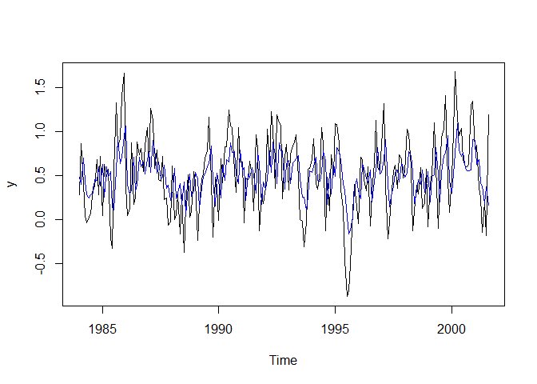
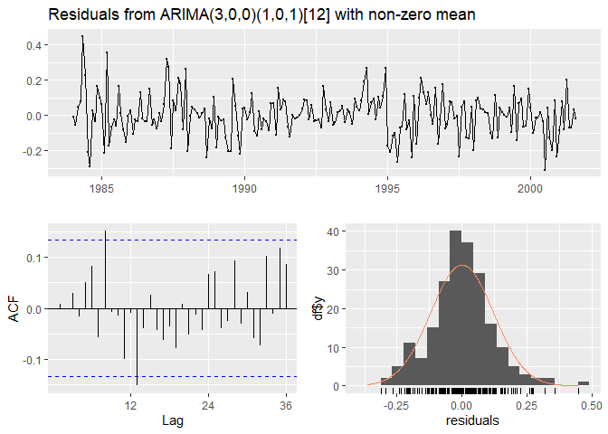

README
================

The purpose of this assignment is to find the best univariate, linear,
stochastic model (BULSM) for two given time series using the Box-Jenkins
methodology. {Spread} refers to the time series spread between a 1 year
and a 3 month US Treasury bill, and {y} a simulated stationary ARMA(p,q)
process.

The analysis for each series will be structured as follows:

1.  Present basic first step analysis. (Plot, ACF, PACF with
    interpretations and conclusions)

1.1. Interpretation and conclusions

2.  Investigate the following models for potential BULSM: AR(1), AR(2),
    MA(2), ARMA(1,1), ARMA(2,1). This includes selecting the best model
    according to the AIC & BIC measures.

2.1.

3.  Evaluate whether the selected model is adequate. That is, whether
    the selected model is both congruant and parsimonious:

3.1. Congruent. 3.1.1. Ljung Box test 3.1.2. ARCH LM test 3.1.3. Jarque
Bera test 3.1.4. Conclusions

Requiress the residuals to be white noise and normally distributed.
Autocorrelation test (Ljung Box test), ARCH test (ARCH LM test), and
normality (Jarque-Bera test).

3.2. Parsimonious

The minimum requirement is that the estimates be statistically
significant. Then select the fitted model with the lowest AIC and BIC
values, this model is the then the most parsimonious.

4.  Conclude with the estimated results of the BULSM.

———{y}———–

1.  Present basic first step analysis. (Plot, ACF, PACF with
    interpretations and conclusions)

``` r
##Plot,ACF and PACF for {y}

forecast::tsdisplay(TS_y)
```

<!-- -->

1.1. Interpretations and conclusions

For the ACF of y, visually, it has an oscillating decay towards zero.
Additionally, the PACF significantly spikes at lag 1, with the PACF
remaining within the bandwidth for lags larger than 1 Therefore, by
visual interpretation I postulate that the y process’ best fit is an
AR(1) model, since the spike in the PACF occurs at the first lag, and
nowhere else.

2.  Investigate the following models for potential BULSM: AR(1), AR(2),
    MA(2), ARMA(1,1), ARMA(2,1). This includes selecting the best model
    according to the AIC & BIC measures.

``` r
##{y}


###AR(1)
AR1_y <- forecast::Arima(TS_y,c(1,0,0))
plot(TS_y)
lines(fitted(AR1_y), col='blue')
```

<!-- -->

``` r
###summary
summary(AR1_y)
```

    ## Series: TS_y 
    ## ARIMA(1,0,0) with non-zero mean 
    ## 
    ## Coefficients:
    ##          ar1    mean
    ##       0.4941  0.5072
    ## s.e.  0.0599  0.0523
    ## 
    ## sigma^2 = 0.151:  log likelihood = -99.55
    ## AIC=205.09   AICc=205.21   BIC=215.16
    ## 
    ## Training set error measures:
    ##                        ME     RMSE       MAE      MPE     MAPE      MASE
    ## Training set 0.0006738706 0.386726 0.3163778 233.4678 349.1124 0.6370634
    ##                    ACF1
    ## Training set 0.02103549

``` r
###AR(2)
AR2_y <- forecast::Arima(TS_y,c(2,0,0))
plot(TS_y)
lines(fitted(AR2_y), col='blue')
```

<!-- -->

``` r
###summary
summary(AR2_y)
```

    ## Series: TS_y 
    ## ARIMA(2,0,0) with non-zero mean 
    ## 
    ## Coefficients:
    ##          ar1      ar2    mean
    ##       0.5154  -0.0416  0.5072
    ## s.e.  0.0698   0.0702  0.0502
    ## 
    ## sigma^2 = 0.1514:  log likelihood = -99.37
    ## AIC=206.74   AICc=206.94   BIC=220.17
    ## 
    ## Training set error measures:
    ##                        ME      RMSE       MAE      MPE     MAPE      MASE
    ## Training set 0.0006885428 0.3864018 0.3160035 235.0747 349.9293 0.6363098
    ##                     ACF1
    ## Training set 0.001986255

``` r
###MA(2)

MA2_y <- forecast::Arima(TS_y,c(0,0,2))
plot(TS_y)
lines(fitted(MA2_y), col='blue')
```

<!-- -->

``` r
###summary
summary(MA2_y)
```

    ## Series: TS_y 
    ## ARIMA(0,0,2) with non-zero mean 
    ## 
    ## Coefficients:
    ##          ma1     ma2    mean
    ##       0.5059  0.1895  0.5067
    ## s.e.  0.0667  0.0737  0.0450
    ## 
    ## sigma^2 = 0.1524:  log likelihood = -100.06
    ## AIC=208.12   AICc=208.32   BIC=221.55
    ## 
    ## Training set error measures:
    ##                        ME      RMSE       MAE      MPE     MAPE      MASE
    ## Training set 0.0006902326 0.3876738 0.3172841 238.9269 356.2071 0.6388884
    ##                    ACF1
    ## Training set 0.01438341

``` r
###ARMA(1,1)

ARMA11_y <- forecast::Arima(TS_y,c(1,0,1))
plot(TS_y)
lines(fitted(ARMA11_y),col='blue')
```

<!-- -->

``` r
###summary
summary(ARMA11_y)
```

    ## Series: TS_y 
    ## ARIMA(1,0,1) with non-zero mean 
    ## 
    ## Coefficients:
    ##          ar1     ma1    mean
    ##       0.4273  0.0894  0.5071
    ## s.e.  0.1284  0.1444  0.0503
    ## 
    ## sigma^2 = 0.1514:  log likelihood = -99.36
    ## AIC=206.72   AICc=206.91   BIC=220.14
    ## 
    ## Training set error measures:
    ##                        ME     RMSE       MAE      MPE     MAPE      MASE
    ## Training set 0.0007429472 0.386379 0.3159959 235.0554 349.7796 0.6362945
    ##                     ACF1
    ## Training set 0.000744146

``` r
###ARMA(2,1)

ARMA21_y <- forecast::Arima(TS_y,c(2,0,1))
plot(TS_y)
lines(fitted(ARMA21_y),col='blue')
```

<!-- -->

``` r
###summary
summary(ARMA21_y)
```

    ## Series: TS_y 
    ## ARIMA(2,0,1) with non-zero mean 
    ## 
    ## Coefficients:
    ##          ar1     ar2     ma1    mean
    ##       0.2319  0.0977  0.2848  0.5071
    ## s.e.  2.3134  1.1611  2.3074  0.0506
    ## 
    ## sigma^2 = 0.1521:  log likelihood = -99.35
    ## AIC=208.69   AICc=208.98   BIC=225.47
    ## 
    ## Training set error measures:
    ##                        ME      RMSE       MAE      MPE     MAPE      MASE
    ## Training set 0.0007307277 0.3863551 0.3159889 234.7491 349.2785 0.6362802
    ##                      ACF1
    ## Training set 0.0007207667

2.1. Interpretation

Visually, the majority of the models seem to fit rather well. However,
the AR(1) model has the lowest AIC and BIC values (205.09 and 215.16,
respectively). Therefore, by this measure we preliminary select this
model and conduct further tests for adequacy.

3.  Evaluate whether the selected model is adequate. That is, whether
    the selected model is both congruent (3.1) and parsimonious (3.2)

3.1. Congruent

Congruence requires the residuals to be white noise and normally
distributed. Test for autocorrelation (Ljung Box test), ARCH test (ARCH
LM test), and normality (Jarque-Bera test).

``` r
AR1_y <- forecast::Arima(TS_y,c(1,0,0))
```

``` r
Res2 <- forecast::checkresiduals(AR1_y, lag=20)
```

<!-- -->

    ## 
    ##  Ljung-Box test
    ## 
    ## data:  Residuals from ARIMA(1,0,0) with non-zero mean
    ## Q* = 19.31, df = 18, p-value = 0.373
    ## 
    ## Model df: 2.   Total lags used: 20

Visually, The corelogram (ACF) of the residuals does indeed look like a
realization of white noise. However, we interpret the Ljung-Box test for
20 lags to make more informed conclusions.

3.1.1. Ljung Box Test

The Ljung Box test is a way to test for the absence of serial
autocorrelation, up to a specified lag k. Therefore the bigger the lag
the stronger the test. When the Ljung Box test is applied to the
residuals of an ARIMA model, the degrees of freedom must be equal to
m-b, where where m is the time lag, and b the number of estimated
parameters in the ARIMA(p,q) model. Thankfully, R selects the correct df
by default.

The underlying hypothesis test is given by:

            H0= No serial correlation between residuals (independence)
            H1= Serial correlation between residuals (dependence)       

The p-value = 0.373 \> 0.05 means we fail to reject the null. Therefore
the residuals are independent at the 95% level and thus an AR(1) model
provides a good model fit (by the measure of autocorrelation between
residuals).

3.1.2. ARCH LM test (Heteroskedasticity)

``` r
pacman::p_load(tseries)

pacman::p_load(FinTS)

ArchTest(residuals(AR1_y))
```

    ## 
    ##  ARCH LM-test; Null hypothesis: no ARCH effects
    ## 
    ## data:  residuals(AR1_y)
    ## Chi-squared = 11.288, df = 12, p-value = 0.5044

The ARCH LM test indicates whether the residuals are homoskedastistic:

            H0= No ARCH effects 
            H1= ARCH effects
            

The p-value = 0.5044 \> 0.05 implies that the we fail to reject null.
Therefore there is no ARCH effects within the residuals.
i.e. Homoskedasticity. (This is an obvious result be construction of the
y process)

3.1.3. Jarque Bera Test

``` r
jarque.bera.test(residuals(AR1_y))
```

    ## 
    ##  Jarque Bera Test
    ## 
    ## data:  residuals(AR1_y)
    ## X-squared = 1.8101, df = 2, p-value = 0.4045

The Jarque-Bera test is a goodness-of-fit test that determines whether
or not sample data have skewness and kurtosis that matches a normal
distribution. A normal distribution has a skew of zero (i.e. it’s
perfectly symmetrical around the mean) and a kurtosis of three; kurtosis
tells you how much data is in the tails and gives you an idea about how
“peaked” the distribution is.

Therefore, we are testing against the null hypothesis that the residuals
are normally distributed at the 5% significance level:

            H0= Residuals are normally distributed 
            H1= Residuals are not normally distributed 
            

The p-value = 0.4045 \> 0.05 means we fail to reject the null at the 5%
significance level. That is, the residuals are normally distributed.

3.1.4. Conclusion

For the y process, the AR(1) model satisfies the necessary requirements
for congruence.

3.2. Parsimonious

``` r
coeftest(AR1_y)
```

    ## 
    ## z test of coefficients:
    ## 
    ##           Estimate Std. Error z value  Pr(>|z|)    
    ## ar1       0.494074   0.059856  8.2544 < 2.2e-16 ***
    ## intercept 0.507176   0.052261  9.7047 < 2.2e-16 ***
    ## ---
    ## Signif. codes:  0 '***' 0.001 '**' 0.01 '*' 0.05 '.' 0.1 ' ' 1

The minimum requirement is that the estimates be statistically
significant. Then select the fitted model with the lowest AIC and BIC
values, this model is then the most parsimonious. All these requirements
are met.

3.2.1. Conclusion

By its construction, we know that the AR(1) model will be parsimonious
as y is a simulated stationary ARMA(p,q) process. For confirmation
however, the coefficients are all statistically significant.
Additionally (as already indicated in the first step), the AR(1) model
has the lowest AIC and BIC values between the pool of ARIMA models
tested.

4.  Conclude with the estimated results of the BULSM.

——–{Spread}——–

1.  Present basic first step analysis. (Plot, ACF, PACF with
    interpretations and conclusions)

``` r
##Plot,ACF and PACF for {Spread}

forecast::tsdisplay(TS_spread)
```

<!-- -->

1.1. Interpretations and conclusions

The ACF for the spread process visually showcases an oscillating decay,
whereas the PACF has multiple spikes outside of the bandwidth (these
multiple spikes makes visually postulating a best fit model a difficult
task). However, if an ARMA(p,q) model was the best fit, then the ACF
would decay (either direct or oscillatory) beginning from lag q, and the
PACF would decay (either direct or oscillatory) beginning from lag q.
Therefore form this initial visual interpretation, an ARMA(1,1) model
seems like a possible best fit, however, the randomness in the spikes of
the PACF makes this process uncertain.

2.  Investigate the following models for potential BULSM: AR(1), AR(2),
    MA(2), ARMA(1,1), ARMA(2,1). This includes selecting the best model
    according to the AIC & BIC measures.

``` r
##{Spread}

###AR(1)

AR1 <- forecast::Arima(TS_spread,c(1,0,0))
plot(TS_spread)
lines(fitted(AR1), col='blue')
```

<!-- -->

``` r
###summary
summary(AR1)
```

    ## Series: TS_spread 
    ## ARIMA(1,0,0) with non-zero mean 
    ## 
    ## Coefficients:
    ##          ar1    mean
    ##       0.9045  0.1902
    ## s.e.  0.0284  0.0903
    ## 
    ## sigma^2 = 0.0173:  log likelihood = 129.41
    ## AIC=-252.83   AICc=-252.71   BIC=-242.76
    ## 
    ## Training set error measures:
    ##                        ME      RMSE        MAE  MPE MAPE      MASE      ACF1
    ## Training set 4.089987e-05 0.1308896 0.09606155 -Inf  Inf 0.2851761 0.2634687

``` r
###AR(2)
AR2 <- forecast::Arima(TS_spread,c(2,0,0))
plot(TS_spread)
lines(fitted(AR1), col='blue')
```

<!-- -->

``` r
###summary
summary(AR2)
```

    ## Series: TS_spread 
    ## ARIMA(2,0,0) with non-zero mean 
    ## 
    ## Coefficients:
    ##          ar1      ar2    mean
    ##       1.1638  -0.2856  0.1967
    ## s.e.  0.0655   0.0656  0.0692
    ## 
    ## sigma^2 = 0.01594:  log likelihood = 138.47
    ## AIC=-268.93   AICc=-268.74   BIC=-255.51
    ## 
    ## Training set error measures:
    ##                        ME     RMSE        MAE  MPE MAPE      MASE       ACF1
    ## Training set 2.736761e-05 0.125365 0.09296701 -Inf  Inf 0.2759893 0.06865052

``` r
###MA(2)

MA2 <- forecast::Arima(TS_spread,c(0,0,2))
plot(TS_spread)
lines(fitted(MA2), col='blue')
```

<!-- -->

``` r
###summary
summary(MA2)
```

    ## Series: TS_spread 
    ## ARIMA(0,0,2) with non-zero mean 
    ## 
    ## Coefficients:
    ##          ma1     ma2    mean
    ##       1.2316  0.5412  0.2019
    ## s.e.  0.0583  0.0431  0.0285
    ## 
    ## sigma^2 = 0.02285:  log likelihood = 100.4
    ## AIC=-192.79   AICc=-192.6   BIC=-179.37
    ## 
    ## Training set error measures:
    ##                         ME      RMSE       MAE  MPE MAPE      MASE      ACF1
    ## Training set -0.0001092165 0.1500871 0.1121802 -Inf  Inf 0.3330273 0.2487238

``` r
###ARMA(1,1)

ARMA11 <- forecast::Arima(TS_spread,c(1,0,1))
plot(TS_spread)
lines(fitted(ARMA11),col='blue')
```

<!-- -->

``` r
###summary
summary(ARMA11)
```

    ## Series: TS_spread 
    ## ARIMA(1,0,1) with non-zero mean 
    ## 
    ## Coefficients:
    ##          ar1     ma1    mean
    ##       0.8371  0.4199  0.1956
    ## s.e.  0.0397  0.0679  0.0718
    ## 
    ## sigma^2 = 0.01532:  log likelihood = 142.6
    ## AIC=-277.2   AICc=-277   BIC=-263.77
    ## 
    ## Training set error measures:
    ##                        ME      RMSE        MAE  MPE MAPE      MASE        ACF1
    ## Training set 3.823751e-05 0.1229113 0.09130108 -Inf  Inf 0.2710437 -0.01183017

``` r
###ARMA(2,1)

ARMA21 <- forecast::Arima(TS_spread,c(2,0,1))
plot(TS_spread)
lines(fitted(ARMA21),col='blue')
```

<!-- -->

``` r
###summary
summary(ARMA21)
```

    ## Series: TS_spread 
    ## ARIMA(2,0,1) with non-zero mean 
    ## 
    ## Coefficients:
    ##         ar1     ar2     ma1    mean
    ##       0.754  0.0816  0.4866  0.1952
    ## s.e.  0.143  0.1358  0.1222  0.0743
    ## 
    ## sigma^2 = 0.01537:  log likelihood = 142.78
    ## AIC=-275.56   AICc=-275.27   BIC=-258.78
    ## 
    ## Training set error measures:
    ##                       ME      RMSE        MAE  MPE MAPE      MASE        ACF1
    ## Training set 7.86675e-06 0.1228064 0.09106651 -Inf  Inf 0.2703474 0.001325205

2.1. Interpretations and conclusions

Visually, it is difficult (or near impossible in this case) to state
which ARMA model is the best fit .However, the ARMA(1,1) model has the
lowest AIC and BIC values (-277.2 and -263.77, respectively), and by
this measure we select the ARMA(1,1) model as the preliminary best fit
and conduct further tests to verify the model as the BULSM.

3.  Evaluate whether the selected model is adequate. That is, whether
    the selected model is both congruent (3.1) and parsimonious (3.2)

3.1. Congruent

Congruence requires the residuals to be white noise and normally
distributed. Autocorrelation test (Ljung Box test), ARCH test (ARCH LM
test), and normality (Jarque-Bera test).

``` r
ARMA11 <- forecast::Arima(TS_spread,c(1,0,1))
```

``` r
Res1 <- forecast::checkresiduals(ARMA11, lag = 20)
```

<!-- -->

    ## 
    ##  Ljung-Box test
    ## 
    ## data:  Residuals from ARIMA(1,0,1) with non-zero mean
    ## Q* = 22.435, df = 17, p-value = 0.1686
    ## 
    ## Model df: 3.   Total lags used: 20

Visually, The corelogram (ACF) of the residuals does not particularly
look like a realization of white noise. However, we interpret the
Ljung-Box test for 20 lags to make informed conclusions.

3.1.1. Ljung Box Test

The Ljung Box test is a way to test for the absence of serial
autocorrelation, up to a specified lag k. Therefore the bigger the lag
the stronger the test. When the Ljung Box test is applied to the
residuals of an ARIMA model, the degrees of freedom must be equal to
m-b, where where m is the time lag, and b the number of estimated
parameters in the ARIMA(p,q) model. Thankfully, R selects the correct df
by default.

The underlying hypothesis test is given by:

            H0= No serial correlation between residuals (independence)
            H1= Serial correlation between residuals (dependence)       

The p-value = 0.1686 \> 0.05 means we fail to reject the null. Therefore
the residuals are independent at the 95% level and thus an ARMA(1,1)
model provides a good model fit (by the measure of autocorrelation
between residuals).

``` r
pacman::p_load(tseries)

ArchTest(residuals(ARMA11))
```

    ## 
    ##  ARCH LM-test; Null hypothesis: no ARCH effects
    ## 
    ## data:  residuals(ARMA11)
    ## Chi-squared = 24.014, df = 12, p-value = 0.02025

3.1.2. ARCH LM test (Heteroskedasticity)

The ARCH LM tests whether the residuals are homoskedastistic:

            H0= No ARCH effects 
            H1= ARCH effects
            

The p-value = 0.02025 \< 0.05 implies that the null is rejected.
Therefore there is ARCH effects within the residuals.
i.e. Heteroskedasticity. (Therefore, we already know that the residuals
are not normally distributed)

``` r
jarque.bera.test(residuals(ARMA11))
```

    ## 
    ##  Jarque Bera Test
    ## 
    ## data:  residuals(ARMA11)
    ## X-squared = 11.055, df = 2, p-value = 0.003976

3.1.3. Jarque Bera Test

The Jarque-Bera test is a goodness-of-fit test that determines whether
or not sample data have skewness and kurtosis that matches a normal
distribution. A normal distribution has a skew of zero (i.e. it’s
perfectly symmetrical around the mean) and a kurtosis of three; kurtosis
tells you how much data is in the tails and gives you an idea about how
“peaked” the distribution is.

Therefore, we are testing against the null hypothesis that the residuals
are normally distributed at the 5% significance level:

            H0= Residuals are normally distributed 
            H1= Residuals are not normally distributed 
            

The p-value = 0.003976 \> 0.05 means we reject the null at the 5%
significance level. That is, the residuals are not normally distributed.

3.1.4. Conclusion

The ARMA(1,1) is clearly not congruent as the residuals possess ARCH
effects and are non-normally distributed.

3.2. Parsimonious

``` r
coeftest(ARMA11)
```

    ## 
    ## z test of coefficients:
    ## 
    ##           Estimate Std. Error z value  Pr(>|z|)    
    ## ar1       0.837088   0.039725 21.0719 < 2.2e-16 ***
    ## ma1       0.419908   0.067912  6.1831 6.285e-10 ***
    ## intercept 0.195605   0.071788  2.7248  0.006435 ** 
    ## ---
    ## Signif. codes:  0 '***' 0.001 '**' 0.01 '*' 0.05 '.' 0.1 ' ' 1

The minimum requirement is that the estimates be statistically
significant. Then select the fitted model with the lowest AIC and BIC
values, this model is the then the most parsimonious.

Even though the model is clearly not adequate (not congruent), it does
fit the minimum requirement for parsimony of statistically significant
estimates, and has the lowest AIC and BIC values between the pool of
ARIMA models considered. The correct wording would be to say that,
within the pool of ARIMA models considered, the ARMA(1,1) model is the
most parsimonious.

3.3. Conclusions

The ARMA(1,1) model, even though parsimonious, is not congruent and
therefore not adequate. More specifically, the residuals are not
normally distributed (and thus are heteroskedastic). By conducting the
same tests for the other pool of possible best fit ARIMA models, all of
them fails to be congruent. The questions then arises, what to do when
you have heteroskedastic residuals? or non normally distributed
residuals? Can data manipulation solve this issue? What about
seasonality?

The first step would most probably be to fit an ARCH/GARCH model,
however, given that the course has not yet reviewed these topics we
refrain from doing so.

However, lets see what the auto.Arima() function in R says is the best
fit ARIMA model, and to include searches for seasonal ARMA models to
hopefully help me understand the above mentioned questions:

I will now use the auto.Arima() function. The auto.arima() function in R
uses a variation of the Hyndman-Khandakar algorithm (Hyndman &
Khandakar, 2008), which combines unit root tests, minimisation of the
AICc and MLE to obtain an ARIMA model.

``` r
AA_spread <- auto.arima(TS_spread, seasonal= TRUE,stationary = TRUE, stepwise = TRUE, approximation = FALSE, allowdrift = TRUE)
AA_spread
```

    ## Series: TS_spread 
    ## ARIMA(3,0,0)(1,0,1)[12] with non-zero mean 
    ## 
    ## Coefficients:
    ##          ar1      ar2     ar3     sar1    sma1    mean
    ##       1.2543  -0.5748  0.2204  -0.6855  0.8187  0.1899
    ## s.e.  0.0684   0.1028  0.0668   0.1727  0.1389  0.0860
    ## 
    ## sigma^2 = 0.01492:  log likelihood = 146.3
    ## AIC=-278.61   AICc=-278.06   BIC=-255.11

According to the Hyndman-Khandakar algorithm (Hyndman & Khandakar,
2008), the best model fit (provided the criterion that they are
stationary) would be an seasonal ARMA(3,0)(1,1) model. Therefore

We select the seasonal ARMA(3,0)(1,1) model and accordingly conduct the
required tests for adequacy.

``` r
ARMA31_11 <-  forecast::Arima(TS_spread, order=c(3,0,0), seasonal = c(1,0,1))

coeftest(ARMA31_11)
```

    ## 
    ## z test of coefficients:
    ## 
    ##            Estimate Std. Error z value  Pr(>|z|)    
    ## ar1        1.254306   0.068450 18.3245 < 2.2e-16 ***
    ## ar2       -0.574845   0.102815 -5.5911 2.257e-08 ***
    ## ar3        0.220425   0.066768  3.3014 0.0009622 ***
    ## sar1      -0.685502   0.172717 -3.9689 7.220e-05 ***
    ## sma1       0.818745   0.138936  5.8930 3.793e-09 ***
    ## intercept  0.189851   0.086010  2.2073 0.0272926 *  
    ## ---
    ## Signif. codes:  0 '***' 0.001 '**' 0.01 '*' 0.05 '.' 0.1 ' ' 1

``` r
forecast::checkresiduals(ARMA31_11, lag = 20)
```

<!-- -->

    ## 
    ##  Ljung-Box test
    ## 
    ## data:  Residuals from ARIMA(3,0,0)(1,0,1)[12] with non-zero mean
    ## Q* = 19.45, df = 14, p-value = 0.1485
    ## 
    ## Model df: 6.   Total lags used: 20

``` r
ArchTest(residuals(ARMA31_11))
```

    ## 
    ##  ARCH LM-test; Null hypothesis: no ARCH effects
    ## 
    ## data:  residuals(ARMA31_11)
    ## Chi-squared = 23.677, df = 12, p-value = 0.0225

``` r
pacman::p_load(tseries)

jarque.bera.test(residuals(ARMA31_11))
```

    ## 
    ##  Jarque Bera Test
    ## 
    ## data:  residuals(ARMA31_11)
    ## X-squared = 8.2545, df = 2, p-value = 0.01613

Even with the proclaimed seasonal ARMA(3,0)(1,1), the residuals has ARCH
effects and are non normally distributed. It seems therefore that the
appropraite next step would indeed be to evaluate fitting ARCH/GARCH
models.
