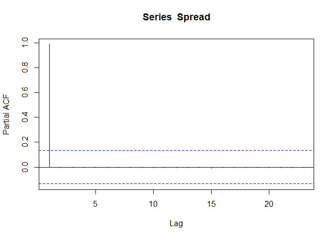
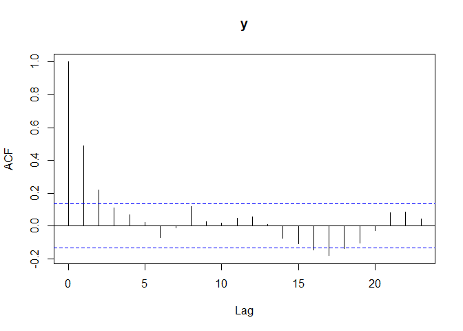

README
================

``` r
library(readxl)
DF1 <- read_excel("data/TSexercise1data.xlsx")
```

``` r
pacman::p_load(dplyr,stats,fixest, tidyverse, huxtable, hrbrthemes, modelsummary, glue)
```

``` r
Spread <- DF1 %>% dplyr::select(spread)
y <- DF1%>% dplyr::select(y)

DF1 <- DF1 %>%
   group_by(dates) %>%
   mutate(dates=as.Date(dates, format = "%Y.%m.%d"))
```

``` r
pacman::p_unload(stats)
```

    ## The following packages are a base install and will not be unloaded:
    ## stats

``` r
pacman::p_load(ggplot)
```

    ## Installing package into 'C:/Users/tianc/OneDrive/Documents/R/win-library/4.1'
    ## (as 'lib' is unspecified)

    ## Warning: package 'ggplot' is not available for this version of R
    ## 
    ## A version of this package for your version of R might be available elsewhere,
    ## see the ideas at
    ## https://cran.r-project.org/doc/manuals/r-patched/R-admin.html#Installing-packages

    ## Warning: unable to access index for repository http://www.stats.ox.ac.uk/pub/RWin/bin/windows/contrib/4.1:
    ##   cannot open URL 'http://www.stats.ox.ac.uk/pub/RWin/bin/windows/contrib/4.1/PACKAGES'

    ## Warning: 'BiocManager' not available.  Could not check Bioconductor.
    ## 
    ## Please use `install.packages('BiocManager')` and then retry.

    ## Warning in p_install(package, character.only = TRUE, ...):

    ## Warning in library(package, lib.loc = lib.loc, character.only = TRUE,
    ## logical.return = TRUE, : there is no package called 'ggplot'

    ## Warning in pacman::p_load(ggplot): Failed to install/load:
    ## ggplot

``` r
##Spread series

DF1 %>% ggplot() + # creates the 'canvas'
theme_bw() + # choose on of many existing themes
geom_line(aes(x = dates, y = spread), size = 1, alpha = 0.9, color = "darkgreen") +
# creates the line on the canvas with aes() coordinates
geom_point(aes(x = dates, y = spread), size = 2, alpha = 0.9, color = "darkgreen") +
# similarly for points
scale_x_date(date_labels = "'%y", date_breaks = "year") +
# make x axis labels
theme(axis.text.x = element_text(angle = 90, vjust = 0.5, hjust=1)) +
# rotate x axis labels
labs(title = "Spread: 1 year and a 3 month US Treasury bill", y = "Spread", x = "Date")
```

<!-- -->

``` r
##y series

DF1 %>% ggplot() + # creates the 'canvas'
theme_bw() + # choose on of many existing themes
geom_line(aes(x = dates, y = y), size = 1, alpha = 0.9, color = "darkgreen") +
# creates the line on the canvas with aes() coordinates
geom_point(aes(x = dates, y = y), size = 2, alpha = 0.9, color = "darkgreen") +
# similarly for points
scale_x_date(date_labels = "'%y", date_breaks = "year") +
# make x axis labels
theme(axis.text.x = element_text(angle = 90, vjust = 0.5, hjust=1)) +
# rotate x axis labels
labs(title = "A simulated stationary ARMA(p,q) process (y)", y = "y", x = "Date")
```

<!-- -->

``` r
 ##For the Spread series

pacman::p_load(stats)

# ACF(Spread)
 
Spread_acf <- stats::acf(
x = Spread,
plot = T, # automatically create a plot
type = "correlation") # we want the standard AF
```

<!-- -->

``` r
#PACF(Spread)

Spread_pacf <- stats::acf(
x = Spread,
plot = T, 
type = "partial") 
```

<!-- -->

``` r
##For the y series

# ACF(y)

y_acf <- stats::acf(
x = y,
plot = T, # automatically create a plot
type = "correlation") # we want the standard AF
```

<!-- -->

``` r
# PACF(y)

y_pacf <- stats::acf(
x = y,
plot = T, 
type = "partial")
```

<!-- -->
