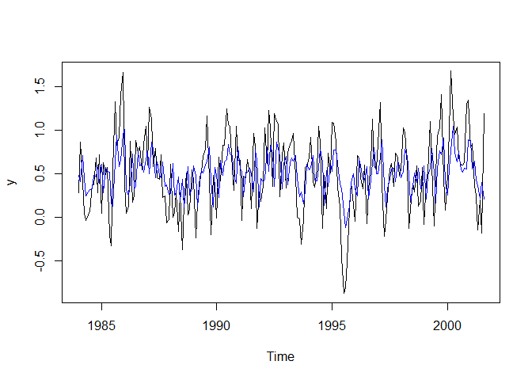

README
================

``` r
library(readxl)
DF1 <- read_excel("data/TSexercise1data.xlsx")

#load required packages

pacman::p_load(dplyr,stats,fixest, tidyverse, huxtable, hrbrthemes, modelsummary, glue,forecast)

#Isolate columns as numeric vectors/variables

Spread <- DF1 %>% dplyr::select(spread)
y <- DF1%>% dplyr::select(y)


#VITAL, mutate dates to :Type Date

DF1 <- DF1 %>%
   group_by(dates) %>%
   mutate(dates=as.Date(dates, format = "%Y.%m.%d"))

Date <- DF1 %>% dplyr::select(dates)
```

``` r
TS_spread <- ts(Spread,start=c(1984,1,1),end = c(2001,8,1),frequency = 12)

TS_y <-  ts(y,start=c(1984,1,1),end = c(2001,8,1),frequency = 12)
```

``` r
##Plot,ACF and PACF for {Spread}

forecast::tsdisplay(TS_spread)
```

<!-- -->

``` r
##Plot,ACF and PACF for {y}

forecast::tsdisplay(TS_y)
```

<!-- -->

``` r
##{Spread}

###AR(1)

AR1 <- forecast::Arima(TS_spread,c(1,0,0))
plot(TS_spread)
lines(fitted(AR1), col='blue')
```

<!-- -->

``` r
###AR(2)
AR2 <- forecast::Arima(TS_spread,c(2,0,0))
plot(TS_spread)
lines(fitted(AR1), col='blue')
```

<!-- -->

``` r
###MA(2)

MA2 <- forecast::Arima(TS_spread,c(0,0,2))
plot(TS_spread)
lines(fitted(MA2), col='blue')
```

<!-- -->

``` r
###ARMA(1,1)

ARMA11 <- forecast::Arima(TS_spread,c(1,0,1))
plot(TS_spread)
lines(fitted(ARMA11),col='blue')
```

<!-- -->

``` r
###ARMA(2,1)

ARMA21 <- forecast::Arima(TS_spread,c(2,0,1))
plot(TS_spread)
lines(fitted(ARMA21),col='blue')
```

<!-- -->

``` r
##{y}


###AR(1)
AR1_y <- forecast::Arima(TS_y,c(1,0,0))
plot(TS_y)
lines(fitted(AR1_y), col='blue')
```

<!-- -->

``` r
###AR(2)
AR2_y <- forecast::Arima(TS_y,c(2,0,0))
plot(TS_y)
lines(fitted(AR2_y), col='blue')
```

<!-- -->

``` r
###MA(2)

MA2_y <- forecast::Arima(TS_y,c(0,0,2))
plot(TS_y)
lines(fitted(MA2_y), col='blue')
```

<!-- -->

``` r
###ARMA(1,1)

ARMA11_y <- forecast::Arima(TS_y,c(1,0,1))
plot(TS_y)
lines(fitted(ARMA11_y),col='blue')
```

<!-- -->

``` r
###ARMA(2,1)

ARMA21_y <- forecast::Arima(TS_y,c(2,0,1))
plot(TS_y)
lines(fitted(ARMA21_y),col='blue')
```

<!-- -->
